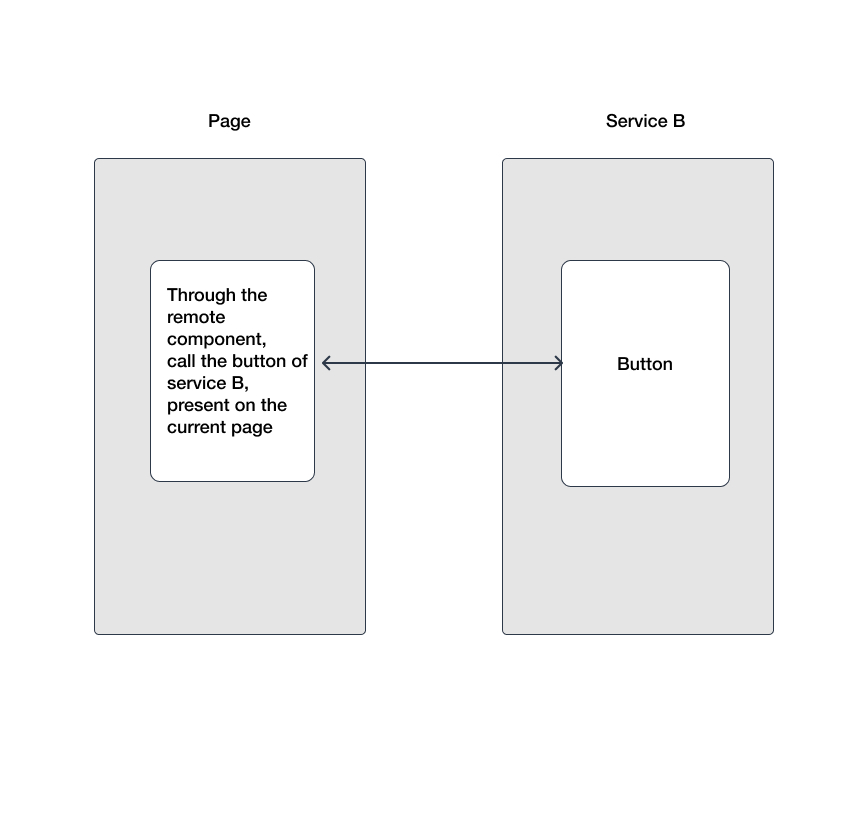
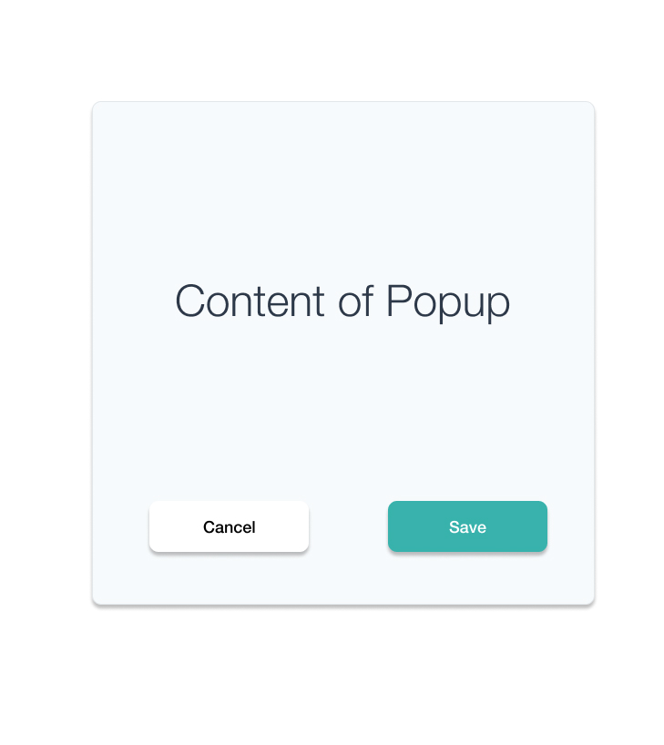

# Further design and thinking of remote components
Remote component is a concept proposed by `Genesis`. It refers to a component that calls another service through an interface. It can be a button, a module, or a page.   

## Embedded call
In addition to embedding pictures, videos and the like, in daily development, the most embedded call is `iframe`.  
The remote component allows you to seamlessly embed another service's page on the server side and client side.    
As shown below:

It's used like this
```vue
<template>
    <remote-view :id="1000" @myEvent="onMyEvent" :fetch="fetch" />
</template>
<script>
export default {
    methods: {
        fetch () {
            // Components that call other services
            const res = await axios.get('/api/ssr-服务名称/render?url=/demo');
            if (res.status === 200) {
                return res.data;
            }
            return null
        },
        onMyEvent () {
            // Handle remote component events
        }
    }
}
</script>
```

## API call
Suppose you have a bullet box like this
As shown below:   
    
This pop-up window has only two states, either cancel or confirm, the operation is complete. Then it can be designed like the following API
```ts
const res = await Popup.show(options);
switch (res) {
    case 'cancel':
        // What users do when they click [Cancel]
        break;
    case 'confirm':
        // What do users do when they click [OK]
        break;
}
```
Seeing above, it is very similar to the way our interface is called, but this time it is not the interface, but a UI component.    
    
The remote component can abstract such a UI component for us to be a component that is really similar to the interface, so its call may be as follows
```ts
const res = await remote.get('/api/ssr-service-name/render?url=/popup');
switch (res) {
    case 'cancel':
        // What users do when they click [Cancel]
        break;
    case 'confirm':
        // What do users do when they click [OK]
        break;
}
```

## Microservices
In fact, the core capability of `Genesis` is that it can truly implement the frontend version of the microservices architecture, independent deployment, independent operation, service and service calls, and communication in the form of API, it will greatly improve the frontend creation force. The concept of micro frontend is just the function it supports by the way.

Why do you need it?    
With the development of frontend SPA applications, the project is getting bigger and bigger, we need an extremely flexible service splitting scheme, using the idea of ​​divide and conquer, to continuously disassemble a large application into a small application, through the form of interface , Can make our application split more flexible.

## At last
`Genesis` has been promoted so many times, but it has not attracted the attention of the community. In fact, I am very happy that this concept and this design idea are popularized, and more mature microservice architecture solutions can be born.
Personal writing skills are a bit poor. If you have any questions, please feel free to discuss them in [issues](https://github.com/fmfe/genesis/issues).    
If you are interested in this project, welcome Star [🔥Vue SSR-based micro frontend, micro service, lightweight solution 🔥](https://github.com/fmfe/genesis)